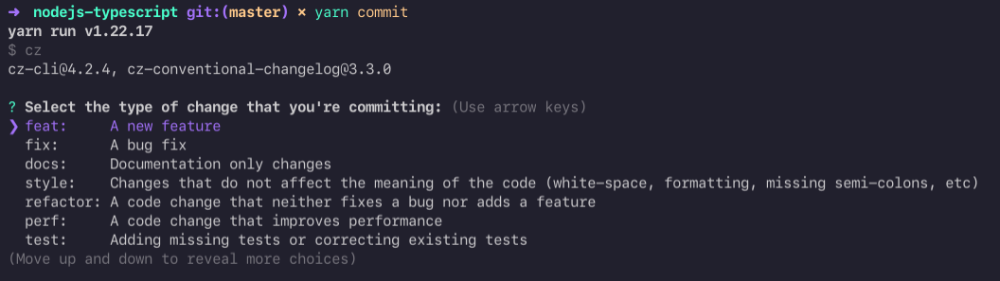

# NodeJS Setup

## :rocket: Technologies

- [Node.js](https://nodejs.org/en/)
- [TypeScript](https://www.typescriptlang.org/)
- [ESLint](https://eslint.org/)
- [Prettier](https://prettier.io/)
- [Jest](https://jestjs.io/pt-BR/)
- [Husky](https://github.com/typicode/husky)
- [lint-staged](https://github.com/okonet/lint-staged)
- [commitlint](https://github.com/conventional-changelog/commitlint)
- [commitizen](https://github.com/commitizen/cz-cli)

## :page_with_curl: Table of Contents

1. [How to reproduce this template](#how-to-reproduce-this-template)
1. [Initial configuration](#initial-configuration)
1. [TypeScript](#typeScript)
1. [Eslint](#eslint)
1. [Prettier](#prettier)
1. [Husky & lint-staged](#husky--lint-staged)
1. [Commitlint](#commitlint)
1. [Commitizen](#commitizen)

## How to reproduce this template

The template of this repository can be reproduced as described in the following steps.

## Initial configuration

Execute the command bellow to install [Yarn](https://yarnpkg.com/), the alternative package manager over [npm](https://www.npmjs.com/).

```
npm install -g yarn
```

Run the command below and yarn will guide you through creating the `package.json` file.

```bash
yarn init -y
```

Add property `private` as `true` in `package.json` file. This is a way to prevent accidental publication of private repositories.

> To simplify others properties have been omitted here and in the rest of the code snippets in this guide.

```json
{
  "private": true
}
```

## TypeScript

[TypeScript](https://www.typescriptlang.org/) is a highly typed programming language maintained by [Microsoft](https://www.microsoft.com/). All TypeScript code is converted to JavaScript, which consequently can be runs anywhere JavaScript runs.

```bash
yarn add typescript -D
```

After adding the dev dependency, create a `tsconfig.json` file under the root of the project.

```json
{
  "compilerOptions": {
    "target": "es2021",
    "module": "commonjs",
    "outDir": "build",
    "rootDir": "src",
    "esModuleInterop": true,
    "forceConsistentCasingInFileNames": true,
    "strict": true,
    "skipLibCheck": true
  },
  "include": ["src"],
  "exclude": ["node_modules"]
}
```

The file above configures the behavior of the compiler.

Now let's understand some properties:

- [`es2021`](https://262.ecma-international.org/12.0/) features will be used when generating the distributable version
- use the [`commonjs`](https://nodejs.org/docs/latest/api/modules.html) module system
- generate JavaScript files inside `/build` folder
- include all files inside `/src` folder
- exclude all files inside `/node_modules` folder
- the other properties are recommended by typescript and you can check the meaning [here](https://www.typescriptlang.org/tsconfig).

The next step is install `ts-node-dev` dependency. It's a tool that compiles your projects with typescript and restarts the project when any file is modified.

```bash
yarn add ts-node-dev -D
```

Add `scripts` property in your `package.json` file.

```json
{
  "scripts": {
    "build": "tsc",
    "dev": "ts-node-dev src/index.ts"
  }
}
```

Now create the main file `src/index.ts` and fill it with the following content.

```typescript
console.log('Hello World!')
```

This configuration allows you to run the command `yarn dev` to execute application in development mode.

The `build` property in `scripts` run the typescript compiler (tsc) and generate a distributable version inside `/build` folder. To check the behavior run the `yarn build` command.

## ESLint

ESLint is a code analysis tool to identify problems and bad practices in JavaScript and TypeScript code.

To install this package, run the following command:

```bash
npx eslint --init
```

The next lines contain a set of questions and answers that reproduce the configuration applied in this repository.

<hr>

**How would you like to use ESLint?**

> To check syntax, find problems, and enforce code style

**What type of modules does your project use?**

> JavaScript modules (import/export)

**Which framework does your project use?**

> None of these

**Does your project use TypeScript?**

> Yes

**Where does your code run?**

> Node

**How would you like to define a style for your project?**

> Use a popular style guide

**Which style guide do you want to follow?**

> Airbnb: https://github.com/airbnb/javascript

**What format do you want your config file to be in?**

> JSON

**Would you like to install them now with npm?**

> Yes

<hr>

As we are using `yarn` remove the `package-lock.json` file that was created by the previous command and run `yarn install` to update the package references.

After completing the installation, the `.eslintrc.json` file will be created inside root folder

```json
{
  "env": {
    "es2021": true,
    "node": true
  },
  "extends": ["airbnb-base"],
  "parser": "@typescript-eslint/parser",
  "parserOptions": {
    "ecmaVersion": "latest",
    "sourceType": "module"
  },
  "plugins": ["@typescript-eslint"],
  "rules": {}
}
```

and some dev dependencies will be added in `package.json` file

```diff
{
  "devDependencies": {
+   "@typescript-eslint/eslint-plugin": "^5.10.2",
+   "@typescript-eslint/parser": "^5.10.2",
+   "eslint": "^8.8.0",
+   "eslint-config-airbnb-base": "^15.0.0",
+   "eslint-plugin-import": "^2.25.4",
    "ts-node-dev": "^1.1.8",
    "typescript": "^4.5.5"
  }
}
```

> If you are using [VSCode](https://code.visualstudio.com/) is necessary install the [ESLint Plugin](https://marketplace.visualstudio.com/items?itemName=dbaeumer.vscode-eslint).

Now let's add a script to the `package.json` file to see eslint in action.

```diff
{
  "scripts": {
    "build": "tsc",
    "dev": "ts-node-dev src/index.ts",
+   "lint": "eslint src --ext .ts"
  }
}
```

Using this command any file with `.ts` extension inside `src` folder will be analyzed by the eslint plugin. So when running:

```bash
yarn lint
```

the result should be similar to this:


To avoid import erros


...apply some configurations in the `eslintrc.json` file:

```diff
{
  "rules": {
    "prettier/prettier": "error",
+    "import/extensions": [
+      "error",
+      "ignorePackages",
+      {
+        "ts": "never"
+      }
+    ]
   },
+  "settings": {
+    "import/resolver": {
+      "node": {
+        "extensions": [".ts"]
+      }
+    }
+  }
}
```


## Prettier

The prettier is a text formatter for javascript and typescript files.

To install prettier in your project run the following command:

```bash
yarn add prettier -D
```

To enable prettier rules into ESLint rules install the following dependency:

```bash
yarn add eslint-plugin-prettier -D
```

Then, in `.eslintrc.json` file, put these lines:

```diff
{
  "plugins": [
    "@typescript-eslint",
+    "prettier"
  ],
  "rules": {
+    "prettier/prettier": "error"
  }
}
```

> For more details see the [eslint-plugin-prettier](https://github.com/prettier/eslint-plugin-prettier) repository.

To prevent the prettier and eslint rules from conflicting, it's necessary to install the following plugin:

```bash
yarn add eslint-config-prettier -D
```

Then, in `.eslintrc.json` file, put these lines:

```diff
{
  "extends": [
    "airbnb-base",
+   "plugin:prettier/recommended",
+   "eslint:recommended",
+   "plugin:@typescript-eslint/eslint-recommended",
+   "plugin:@typescript-eslint/recommended"
  ]
}
```

> For more details see the [eslint-config-prettier](https://github.com/prettier/eslint-config-prettier) repository.

> If you are using [VSCode](https://code.visualstudio.com/), is necessary install the [Prettier Plugin](https://marketplace.visualstudio.com/items?itemName=esbenp.prettier-vscode).

The next step is create a `.prettierrc.json` file inside root folder:

```json
{
  "semi": false,
  "trailingComma": "all",
  "singleQuote": true,
  "printWidth": 85,
  "tabWidth": 2
}
```

> Change the settings according to your need. See the [prettier options](https://prettier.io/docs/en/options.html) for more details.

## Jest

Jest is a popular JavaScript Testing Framework. To install it, just run the command below:

```bash
yarn add jest @types/jest ts-jest -D
```

After installing, perform the configuration by running the command below:

```bash
yarn jest --init
```

The next lines contain a set of questions and answers that reproduce the configuration applied in this repository.

<hr>

It seems that you already have a jest configuration, do you want to override it?

> yes

Would you like to use Typescript for the configuration file?

> yes

Choose the test environment that will be used for testing

> node

Do you want Jest to add coverage reports?

> yes

Which provider should be used to instrument code for coverage?

> v8

Automatically clear mock calls, instances and results before every test?

> yes

<hr>

After performing the installation, change the `jest.config.ts` file as shown below:

```diff
{
-  // preset: undefined,
+  preset: 'ts-jest',

-  // testMatch: [
-  //   "**/__tests__/**/*.[jt]s?(x)",
-  //   "**/?(*.)+(spec|test).[tj]s?(x)"
-  // ],
+  testMatch: ['**/**/*.spec.ts'],
}
```

> This setting tells jest that all files ending with `.spec.ts` will be considered test files.

The next step is to configure eslint to understand the jest global definitions. To do this, install the following plugin:

```bash
yarn add eslint-plugin-jest -D
```

And change `eslintrc.json` file:

```diff
{
  "env": {
    "es2021": true,
    "node": true,
+   "jest/globals": true
  },

  "plugins": [
    "@typescript-eslint",
    "prettier",
+   "jest"
  ],
}
```

Now, if you execute `yarn test`, the jest will run all tests. :tada:

## :dog: Husky & lint-staged

Husky + lint-staged is a perfect match. [Husky](https://github.com/typicode/husky) uses the power of [git hooks](https://git-scm.com/book/en/v2/Customizing-Git-Git-Hooks) to trigger custom commands and [lint-staged](https://github.com/okonet/lint-staged) allows us to run these commands only in files that are in the git stage area.

Perform the installation with the following command:

```bash
npx mrm@2 lint-staged
```

The above command install Husky and create `.husky` folder with pre-commit hook that references lint-staged script created in `package.json` file.

In this case we will make a small adjustment in the `lint-staged` script.

```diff
{
  "lint-staged": {
-   "*.js": "eslint --cache --fix"
+   "*.ts": "eslint --cache --fix --max-warnings=0"
  }
}
```

- By definition, the lint-staged plugin only monitors files that are in the git stage area.
- The `*.ts` property tells lint-staged to only monitor files ending with `.ts`.
- The command `eslint --cache --fix --max-warnings=0` will be executed for each file.
- The `--max-warnings=0` flag defines the maximum number of warnings allowed by eslint. If you exceed the limit, an error will be thrown.

From now, when performing a commit, any typescript file will be analyzed by eslint. This is awesome :hearts:

If you also want to run Jest after the lint stage, change the package.json file as shown below:

```diff
{
  "lint-staged": {
-    "*.ts": "eslint --cache --fix --max-warnings=0"
+    "*.ts": [
+      "eslint --cache --fix --max-warnings=0",
+      "jest --bail --findRelatedTests --passWithNoTests"
+    ]
+  }
}
```

## Commitlint

The [commitlint](https://github.com/conventional-changelog/commitlint) is tool that checks if your commit messages meet the [conventional commit format](https://conventionalcommits.org/). To install run the command bellow:

```bash
yarn add @commitlint/config-conventional @commitlint/cli -D
```

And create a file named as `commitlint.config.js` inside root folder:

```diff
+ module.exports = { extends: ['@commitlint/config-conventional'] }
```

Now for the commitlint to be triggered by the husky every commit, run the following command:

```bash
npx husky add .husky/commit-msg 'npx --no -- commitlint --edit "$1"'
```

The command above will create a file named as `.husky/commit-msg` into `.husky` folder.

Now non-standard commits will not be allowed :x:

## Commitizen

[Commitizen](https://github.com/commitizen/cz-cli) is a tool that prompt to you fill mandatory fields during commit. To install run the command bellow:

```bash
yarn add commitizen -D
```

Next, initialize your project to use the cz-conventional-changelog adapter:

```bash
yarn commitizen init cz-conventional-changelog --yarn --dev --exact
```

The command above will add the following snippet into `package.json` file:

```diff
{
+  "config": {
+  "commitizen": {
+    "path": "./node_modules/cz-conventional-changelog"
+  }
}
```

Now add the following script to `package.json` file:

```diff
{
  "scripts": {
    "build": "tsc",
    "dev": "ts-node-dev src/index.ts",
    "prepare": "husky install",
    "test": "jest",
+   "commit": "cz"
  },
}
```

To start the iterative commit run `yarn commit` :sunglasses:



In addition to standardization, commitizen helps you to remember the meaning of each commit type.
